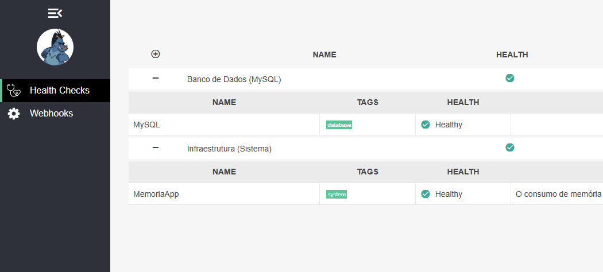
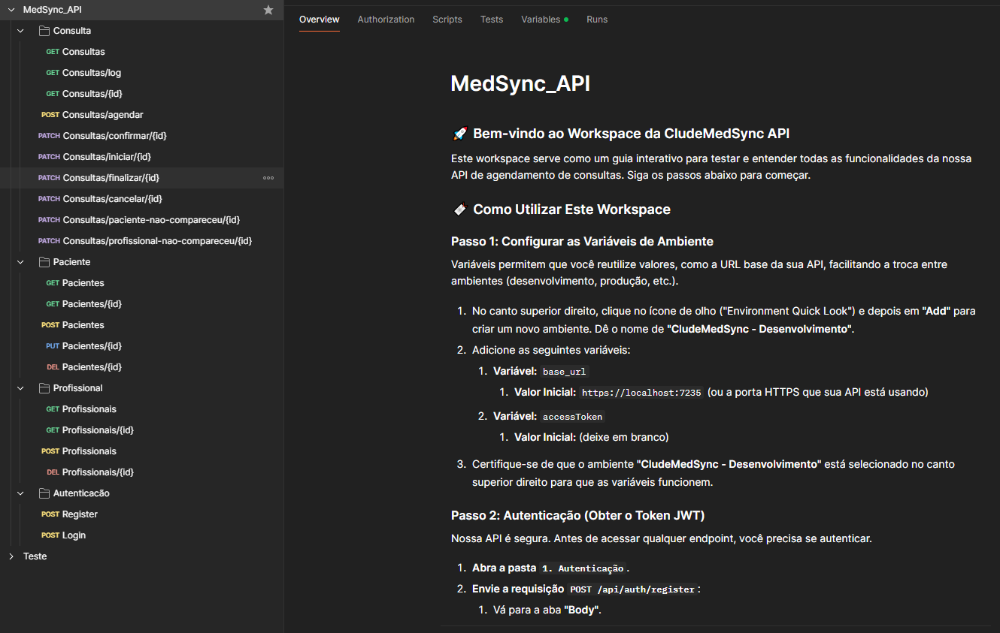
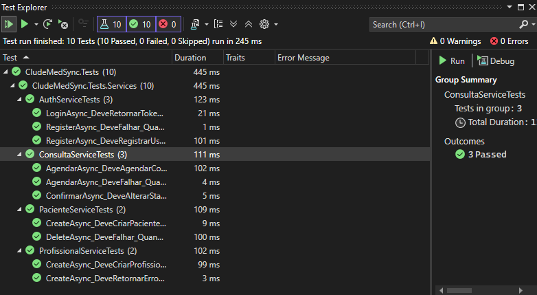

# 🧠 MedSync - Backend (.NET 8 + Dapper)

Este é o backend da aplicação **MedSync**, construído com **ASP.NET Core 8**, utilizando **DDD (Domain-Driven Design)**, autenticação via **JWT**, e acesso a dados com **Dapper**.


---

## 🚀⚙🚀 Coleção Postman
Para facilitar os testes e a exploração da API, uma coleção completa do Postman está disponível. Você pode importá-la para o seu ambiente.

- Clique aqui para baixar a coleção do Postman `../MedSync_API.postman_collection.json`

- A API estará em: `https://localhost:7235`
- Swagger UI: `https://localhost:7235/swagger`

---

## ⚙️ Tecnologias Utilizadas

- .NET 8 SDK
- ASP.NET Core Web API
- Dapper (ORM leve)
- JWT Bearer Authentication
- MySQL (ou SQLite compatível)
- Swagger (Swashbuckle)
- AutoMapper
- xUnit (para testes)
- Health Checks
- Docker (para execução local)

---

## 📁 Estrutura de Pastas

```
/src
  /Domain
  /Application
  /Infrastructure
  /WebApi
```

- **Domain**: Entidades, Regras de Negócio, Interfaces
- **Application**: Serviços, DTOs, Validadores
- **Infrastructure**: Implementações (Dapper, Repositórios, Contextos)
- **WebApi**: Controllers, Configurações, Middlewares

---

## 🔐 Autenticação

- Registro: `POST /api/auth/register` – Retorna uma lista paginada de profissionais. Suporta os parâmetros `?page=1&pageSize=10`, além de filtros dinâmicos e ordenação (crescente/decrescente) por qualquer campo, com validação no backend.
- Login: `POST /api/auth/login`
- Proteção via `[Authorize]` em endpoints privados
- Tokens JWT com refresh token

---

## 📋 Endpoints Principais

### 👤 Usuário
- `POST /api/auth/register` – Registrar
- `POST /api/auth/login` – Login

### 🧑‍⚕️ Profissionais
- `GET /api/profissionais` – Retorna uma lista paginada de profissionais. Suporta os parâmetros `?page=1&pageSize=10`, além de filtros dinâmicos e ordenação (crescente/decrescente) por qualquer campo, com validação no backend.
- `POST /api/profissionais`
- `PUT /api/profissionais/{id}`
- `DELETE /api/profissionais/{id}`

### 👨‍💼 Pacientes
- `GET /api/pacientes` – Retorna uma lista paginada de Pacientes. Suporta os parâmetros `?page=1&pageSize=10`, além de filtros dinâmicos e ordenação (crescente/decrescente) por qualquer campo, com validação no backend.
- `POST /api/pacientes`
- `PUT /api/pacientes/{id}`
- `DELETE /api/pacientes/{id}`

### 📅 Consultas
- `GET /api/consultas` – Retorna uma lista paginada de Consultas. Suporta os parâmetros `?page=1&pageSize=10`, além de filtros dinâmicos e ordenação (crescente/decrescente) por qualquer campo, com validação no backend.
- `GET /api/consultas/log` – Retorna uma lista paginada de Log das consultas. Suporta os parâmetros `?page=1&pageSize=10`, além de filtros dinâmicos e ordenação (crescente/decrescente) por qualquer campo, com validação no backend.
- `POST /api/consultas`
- `PATCH /api/consultas/confirmar/{id}`
- `PATCH /api/consultas/iniciar/{id}`
- `PATCH /api/consultas/finalizar/{id}`
- `PATCH /api/consultas/cancelar/{id}`
- `PATCH /api/consultas/paciente-nao-compareceu/{id}`
- `PATCH /api/consultas/profissional-nao-compareceu/{id}`

---

## 🩺 Monitoramento e Saúde (Health Checks)

A API possui um sistema de Health Checks para monitoramento contínuo da saúde da aplicação e de suas dependências.
Testes de serviços e validações

- Endpoint de Dados (JSON): `GET /saude`
- Dashboard Visual (JSON): `GET /saude-ui`

---

## 🧪 Testes Automatizados

O projeto conta com uma suíte completa de testes unitários e de integração, utilizando `xUnit`, para garantir a qualidade e a estabilidade do código nas camadas de Domínio e de Serviço.

A execução desses testes é automatizada através de pipelines de Integração Contínua (CI) configurados no `GitHub` Actions e no `Azure DevOps`, garantindo que cada alteração no código seja validada antes da integração.

- Testes unitários com `xUnit` em camada de Application e Domain
- Testes de serviços e validações

---

## 🚀 Executando Localmente


📸 *Swagger:*  


📸 *Health Checks UI:*  


📸 *Postman:*  


📸 *Testes Unitarios:*  



### Com .NET CLI

```bash
cd src/WebApi
dotnet restore
dotnet ef database update
dotnet run
```

### Com Docker

```bash
docker-compose up --build
```

- A API estará em: `http://localhost:5000`
- Swagger: `http://localhost:5000/swagger`

---

## 🛠 Scripts SQL

- Criação das tabelas e índices
- Arquivo: `/scripts/db-init.sql`

---

## 📚 Boas Práticas

- Camadas bem definidas (DDD)
- Repositórios separados usando Dapper
- Respostas padronizadas com DTO de `ResultadoOperacao<T>`
- Tratamento global de erros e logs simples
- Configurações externas via `appsettings.json`

---

## 📦 Licença

MIT © 2025 — Desenvolvido como parte do desafio técnico MedSync. 
O objetivo foi construir uma API robusta, bem definida e que segue as melhores práticas de arquitetura de software, como DDD, testes automatizados e monitoramento contínuo.
