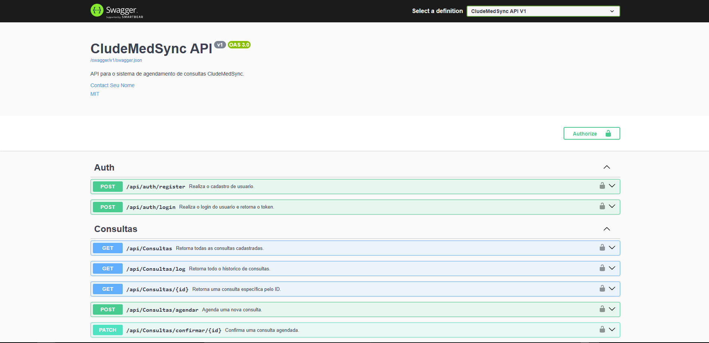
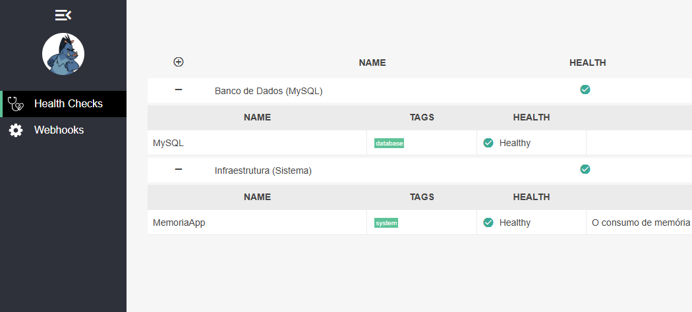
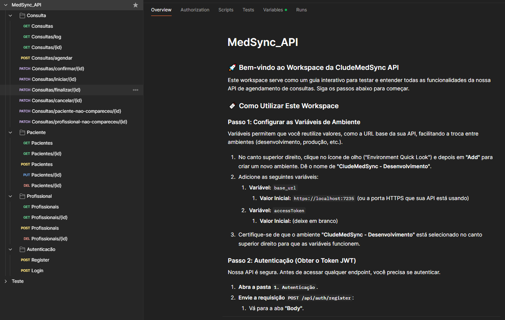
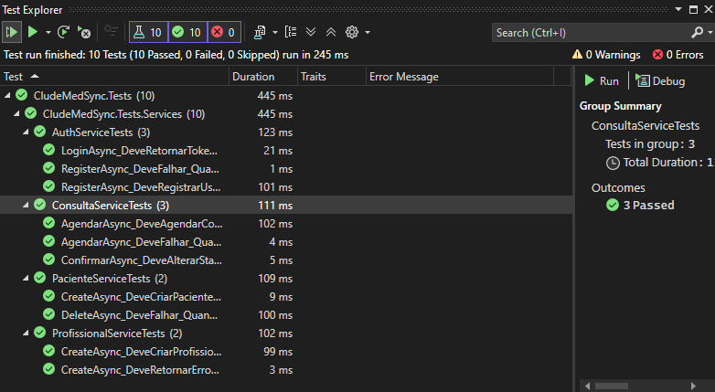

# 🩺 MedSync - Sistema de Gestão de Consultas Médicas

**MedSync** é um sistema completo de agendamento e gerenciamento de consultas para clínicas e consultórios médicos. Ele foi desenvolvido como um desafio técnico para a vaga de Desenvolvedor Pleno C# .NET, com foco em arquitetura limpa, separação de camadas e boas práticas de desenvolvimento fullstack.

---

## 📘 Regras obrigatórias

Na lógica do agendamento (não só no CRUD), você precisa validar:
- 🔄 Um paciente não pode ter mais de uma consulta com o mesmo profissional no mesmo dia.
- 🚫 Um profissional não pode atender mais de uma pessoa no mesmo horário.
- 🕗 Consultas só podem ser entre 08:00 e 18:00, de segunda a sexta.
- ⏱️ Cada consulta dura 30 minutos.
- ✅ Agendamento só pode ocorrer se houver disponibilidade real.

---

## 📌 Visão Geral do Projeto

- **Backend**: ASP.NET Core 8 com autenticação JWT e DDD  
- **Frontend**: React 19 + TypeScript + TailwindCSS + Vite  
- **API RESTful** com documentação via Swagger  
- **Banco de Dados**: MySQL  
- **Deploy Local** com Docker  
- **Testes unitários** com xUnit (backend)  
- **Logs** básicos de requisições e erros  

---

## 🧱 Funcionalidades

### 🔷 Frontend (React)

- Login com persistência de token
- Telas protegidas (Private Routes)
- Listagem e Cadastro de Pacientes e Profissionais
- Agendamento de Consultas com seleção de horário e profissional
- Interface moderna e responsiva (Tailwind + Lucide Icons)
- Formulários com validação usando Zod + React Hook Form
- Modal com Radix UI para ações

---

## 🗂 Estrutura do Projeto

### 📂 Backend (.NET)

- Cadastro/Login de Usuário com JWT
- CRUD de Pacientes
- CRUD de Profissionais de Saúde
- Agendamento de Consultas com Validações de Regras de Negócio:
  - Um paciente só pode ter 1 consulta por profissional por dia
  - Um profissional só pode atender uma consulta por horário
  - Consultas entre 08h e 18h (dias úteis)
- Status da Consulta:
  - Confirmar, Iniciar, Finalizar, Cancelar, Paciente/Profissional não compareceu

### 🚀 Coleção Postman

Para facilitar os testes e a exploração da API, uma coleção completa do Postman está disponível. Você pode importá-la para o seu ambiente.

- [⬇️ Documentação Postman](API/doc/MedSync_API.postman_collection.json)

A API estará em: `https://localhost:7235`  
- Swagger UI: `https://localhost:7235/swagger`

---

### 🩺 Monitoramento e Saúde (Health Checks)

A API possui um sistema de Health Checks para monitoramento contínuo da saúde da aplicação e de suas dependências.

- Endpoint de Dados (JSON): `GET /saude`
- Dashboard Visual (UI): `GET /saude-ui`

📸 *Swagger:*  


📸 *Health Checks UI:*  


📸 *Postman:*  


📸 *Testes Unitarios:*  


---

### 🧪 Testes Automatizados

O projeto conta com uma suíte completa de testes unitários e de integração, utilizando `xUnit`, para garantir a qualidade e a estabilidade do código nas camadas de Domínio e de Serviço.

- Testes unitários com `xUnit` nas camadas de Application e Domain
- Integração com pipelines de CI (GitHub Actions ou Azure DevOps)

---

## 📁 Estrutura de Pastas

### Backend

```
/src
  /Application
  /Domain
  /Infrastructure
  /WebApi
```

- Arquitetura em camadas (DDD)
- Dapper como ORM
- Swagger em `/swagger`

### Frontend

```
/src
  /pages
  /components
  /services
  /contexts
  /hooks
  /routes
  /types
```

- Configurado com ESLint, Tailwind, React Router DOM, Axios, Zod

---

## 🚀 Como Executar

### Requisitos

- Angular
- .NET 8 SDK
- Docker + Docker Compose
- MySQL

### Backend

```bash
cd backend
dotnet restore
dotnet ef database update
dotnet run
```

### Frontend

```bash
cd frontend
npm install
npm run dev
```

### Docker

```bash
docker-compose up --build
```

---

## 📄 Subdocumentações

- [`/API/README.md`](API/README.md) - Documentação técnica da API (.NET)
- [`/FRONT/README.md`](FRONT/README.md) - Documentação técnica do React App
- [`/scripts/db-init.sql`](API/src/CludeMedSync.Data/Scripts/01_create_database_and_Tables.sql) - Scripts de criação e seed do banco de dados

---

## 👤 Usuário de Teste

```
Email: teste@gmail.com
Senha: Teste@123
```

---

## 📚 Diferenciais Técnicos

- Código limpo e modularizado (DDD + SOLID)
- Validação forte com Zod + React Hook Form
- Modal reutilizável com Radix UI
- Projeto pronto para escalar
- Estrutura de logs e tratamento de erros
- API RESTful bem documentada
- Suporte para CI/CD e deploy em cloud (pronto para extensões)

---

## 📦 Licença

MIT © 2025 — Desenvolvido por Eduardo Guedes para desafio técnico.